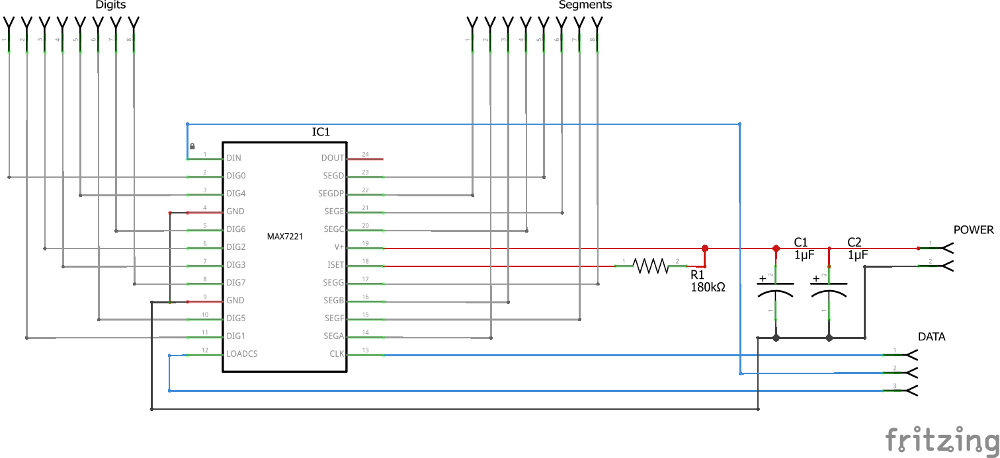

# LED Cube
The LED Cube library is written specifically for the construction scheme outlined in this document, which may differ from other guides for building LED cubes. 

;

The system is based on three distinct parts:

* An Arduino board
* A display control board
* The LED Cube itself

## Cube wiring concept
To map the 8 seven segment displays controlled by the IC to the four 4x4 layers of the cube, it was constructed from 8 half-layers each comprising the 8 LEDs of a single 'digit' (cathodes). The segment 8 'segment' wires (anodes) connect 8 LEDs, one from each of the segments, together.

This wiring concept was developed by Robin Falk.

## Display control board
The display control board holds the 7221/7219 IC, providing a bridge between the 8 cathodes + 8 anodes of the cube, and the connections for power and data on the other end. Its design is directly based on the MAX7219/MAX7221 datasheet[1].

## Connection to Arduino
The two power wires connect to the Arduinos 5V and GND pins.

The data wires can connect to any GPIO pins on the Arduino. The example programs in this repository connect them

# Electronic Parts List
* Arduino Board
* MAX 7221 - or 7219 - Seven Segment Display Controller IC in DIP package
* 24 pin DIP DIL socket to avoid soldering in the IC directly
* 64 LEDs
* 180kOhm resistor
* 100uF Electrolytic Capacitor
* 0.1uF Electrolytic Capacitor
* prototyping circuit board or bread board and wires or Arduino proto shield
* Optional: SIL pin sockets/headers for more flexible connections

The programs included here were written for an Arduino Duemilanove, but they should work just the same with newer Arduino-Compatible boards.

Additional parts for constructing the cube will also be required, such as strong wire and a wooden board for the base.

[1] https://www.sparkfun.com/datasheets/Components/General/COM-09622-MAX7219-MAX7221.pdf
